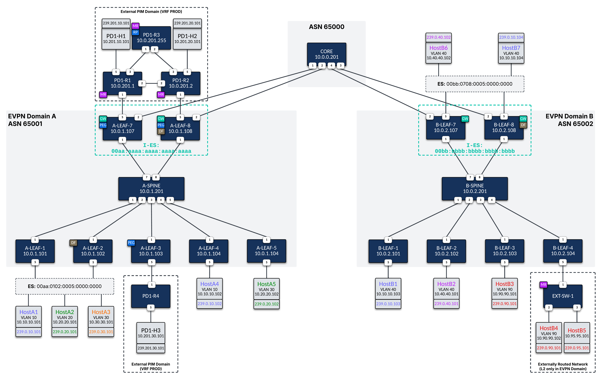

# Arista EVPN Mulicast (OISM) Demo

## QuickStart

From the terminal:

- Start the lab: `make start`
- Stop the lab: `make stop`
- Inspect the lab: `make inspect`

> [!TIP]
> For the best experience, the [VS Code ContainerLab Extension](https://containerlab.dev/manual/vsc-extension/) is Highly Recommended

## Overview

- 21 EOS Nodes
- 15 Ubuntu Nodes
- Built and validated with cEOS-Lab 4.35.0F

## Requirements

- [ContainerLab](https://containerlab.dev/install/) Host
- [cEOS-Lab image](https://www.arista.com/en/support/software-download)
- cEOS-Lab image imported into Docker as `ceos:latest`
- 48G RAM

## Topology

